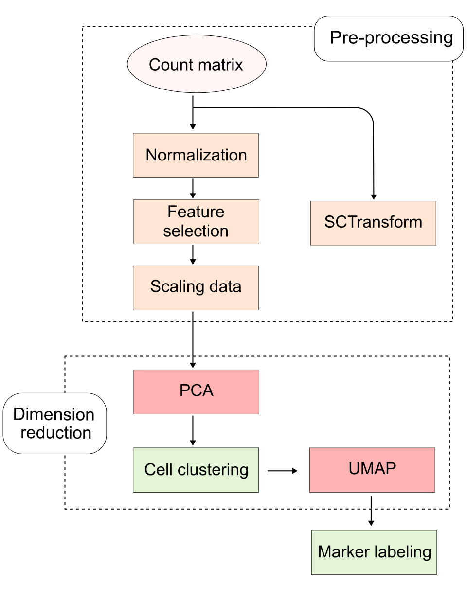

## Motivation

[Seurat](https://satijalab.org/seurat/) is a popular standard bioinformatic tool to explore and analyze single cell data. The vignette (tutorial) ["Guided Clustering Tutorial"](https://satijalab.org/seurat/articles/pbmc3k_tutorial) is seemed to be a foundation material for newcomers to get used to analysis steps in this domain.    

Eventhough the vignette provides a solid scaffold for a primaritive scRNA-seq analysis by displaying the command lines and the brief abstractions, it is still lacked of the thoughtful insight and the midset of using algorithmic and statistic methods. It is an obstacle for someone being curious about the "under-the-hood" as being insufficient in technical foundation.    

I write this blog as a extension of the Seurat vignette, exploring the proceeses run underneath the "easy-going" commands and delivering their reasoning.  

## Content

The content in this blog strictly follows typical functional steps in Seurat vignette by showing the command used in the tutorial and explaining the underlying processes of each step. 

First, the count matrix from the 10X Genomics comes through pre-processing stages to reduces technical noise and unexpected variance, it includes three main steps: [Normalization](./normalization.md), [Feature selection](./variable_features.md), and [Scaling data](./scaling.md). Moreover, an alternative approach is performing [SCTransform](./sctransform.md).

Based on purified data, raw count 