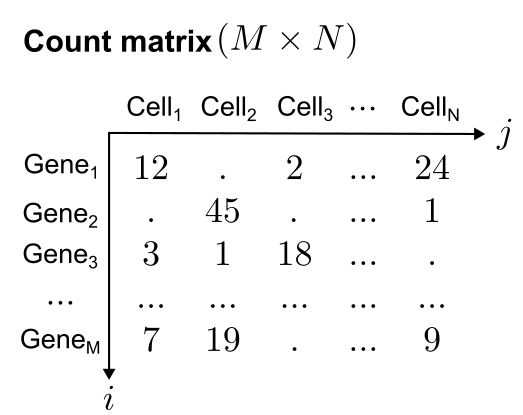

# Normalization

## Introduction

In scRNA-seq experiments, stochastic technical factors (e.g., purification, reverse transcription, and sequencing) introduce non-biological variation in cell sequencing depth. Since this noise obscures true biological signals, normalization is a critical preprocessing step to scale raw counts and enable meaningful cell-to-cell comparisons [@heumosBestPracticesSinglecell2023].

## Methods

There are three methods to normalise data in Seurat, which were used depends on data input.

### Relative counts (`RC`) 

$$\text{RC}_{ij} = \frac{C_{ij}}{\sum_{i=1}^{M}{C_{ij}}} \times \text{Scale Factor}$$

### Log normalize (`LogNormalize`) 

$$\text{LN}_{ij} = \ln \left( \text{RC}_{ij} + 1 \right)$$

### Centered log ratio transformation (`CLR`)

$$CLR_{ij} = \ln \left( 1 + \frac{C_{ij}}{\exp \left( \frac{1}{M} \sum_{k=1}^{M} \ln(1 + C_{kj}) \right)} \right)$$

## Summary