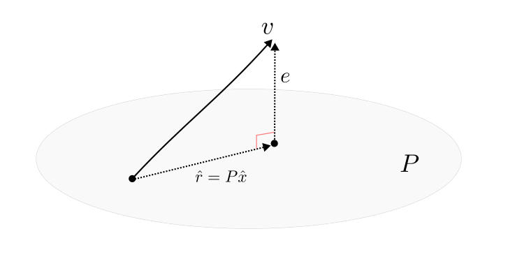

## Introduction

:::{tip} Seurat command

```R
## Perform linear dimensional reduction
pbmc <- RunPCA(pbmc, features = VariableFeatures(object = pbmc))

## Determine the ‘dimensionality’ of the dataset
ElbowPlot(pbmc)
```

:::

## Workflow

### Lanczos Bidiagonalization

#### Initializing

The algorithm begins with the input feature matrix $A$ ($n$ cells $\times$ $m$ features) and an initial normalized vector $p_1 \in \mathbb{R}^m$ representing random feature residuals of an arbitrary cell.

```{math}
:label: lanczos-begin
\begin{cases}
\begin{aligned}

\hat{q}_{1} &= A \cdot p_1 \\
q_1 &= \frac{\hat{q}_{1}}{\lVert \hat{q}_{1} \rVert}

\end{aligned}
\end{cases}
```

At the start of the iteration, $A \cdot p_1$ computes the cell similarity scores between all cells in $A$ and the arbitrary cell (cell loadings). Its magnitude is stored as $\alpha_1$, and the scaled unit vector $q_1 \in \mathbb{R}^n$ as described in Equation [](#lanczos-begin).

#### The loop runs

The number of iterations $k$ defines the size of the working Krylov subspace, as reflected by the number of desired singular vectors $v$ (by default, $v=50$; $k=v+7$).

|Stages | $P \in \mathbb{R}^{m \times k}$     |  $Q \in \mathbb{R}^{n \times k}$        |
|:------|:-------- | :---------- |
|**Residulization**   | $\bar{p}_{j+1} = A^T q_j - \lVert \hat{q}_{j} \rVert p_j$ &emsp; (a) |  $\bar{q}_{j+1} = A \cdot p_{j+1} - \lVert \hat{p}_{j+1}  \rVert q_j$      &emsp; (d)     | 
|**Othogonalization** | $\hat{p}_{j+1} = \bar{p}_{j+1} - P_j (P_j^T \bar{p}_{j+1})$ &emsp; (b) | $\hat{q}_{j+1} = \bar{q}_{j+1} - Q_{j+1} (Q^{T}_{j+1} \bar{q}_{j+1})$     &emsp; (e)        |
|**Normalization**    | $p_{j+1} = \hat{p}_{j+1} / \lVert \hat{p}_{j+1} \rVert$ &emsp; (c) | $q_{j+1} = \hat{q}_{j+1} / \lVert \hat{q}_{j+1} \rVert$  &emsp; (f)   |

Throughout the loops, two orthogonormal matrices $P$ and $Q$, which respectively contains feature- and cell-oriented unit vectors for new dimension, are determined. An iteration includes three stages for each matrix, and follows the equations in annotatively alphabetical order.   

The first stage is obtaining loading residuals, which covers indigenous variation while stripping out the loading baseline. Next, Gram-Schmidt orthogonalization is performed to ensure that the next unit vector is strictly independent of all previous ones (where $P_j = [p_1,p_2,\dots,p_j]$, and $Q_{j+1} = [q_1,q_2,\dots,q_{j+1}]$). Finally, the orthogonal vector is performed Euclidean norm to gain the unit vector.

```{math}
:label: bidiagonal-matrix
B = \begin{bmatrix}
\lVert \hat{q}_{1} \rVert &                           &                           &                             & \large 0                 \\
\lVert \hat{p}_{1} \rVert & \lVert \hat{q}_{2} \rVert &                           &                             &                          \\
                          & \lVert \hat{p}_{2} \rVert & \lVert \hat{q}_{3} \rVert &                             &                          \\
                          &                           & \ddots                    & \ddots                      &                          \\
\large 0                  &                           &                           & \lVert \hat{p}_{k-1} \rVert & \lVert \hat{q}_{k} \rVert
\end{bmatrix} \in \mathbb{R}^{k \times k}
```

During the iteration, the lower bidiogonal matrix $B$ is determined according to the Equation [](#bidiagonal-matrix).

:::{tip} Why does $PP^Tv$ represent residual of $v$ on the $P$-space? 



Consider an arbitrary vector $v$ and a linear vector dimension $P$, $v$ always includes 2 components: the residual $r$ on $P$, which is constructed from vectors in the $P$-space with coefficients $\hat{x}$; and the perpendicular component $e$.

```{math}
:label: penper-coeff
\begin{aligned}

P^{T}e &= 0 \\
P^{T}(v - P\hat{x}) &= 0 \\
P^{T}P\hat{x} &= P^{T}v \\

\end{aligned}
```

Hence $e$ is orthogonal (vertical) against $P$, the product of $e$ and foundational vectors of $P$ is 0. Based on that, the relationship between coefficents $\hat{x}$ and vector $v$ is described as Equation [](#penper-coeff), which is well known as the [Normal Equation](https://www.geeksforgeeks.org/machine-learning/ml-normal-equation-in-linear-regression/).    

```{math}
:label: penper-residual
\begin{cases}
\begin{aligned}

\hat{x} &= P^{T}v \\
r &= PP^{T}v

\end{aligned}
\end{cases}
```

Due to the presumption that $P$ is orthogonal, $P^{T}P = I$. Therefore, the coefficients $\hat{x}$ and residual $r$ on the $P$ dimension of vector $v$ are shown as Equation [](#penper-residual).

:::

### Augmented Lanczos Bidiagonalization

```{math}
B = U \Sigma V^{T}
```


```{math}
\lVert \hat{p}_{k} \rVert u_{k} < \delta \sigma_{\text{max}}
```

## Summary