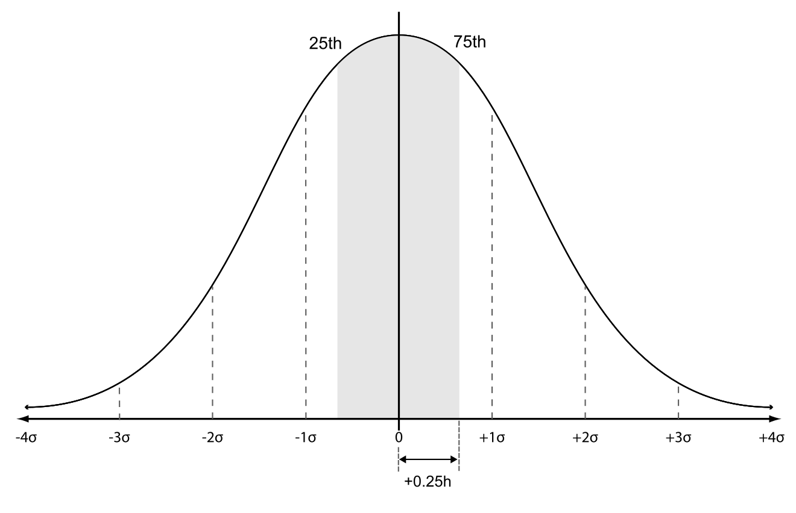

## Introduction

:::{tip} Seurat command

```R
pbmc <- SCTransform(pbmc, vars.to.regress = "percent.mt", verbose = FALSE)
```

:::

## Workflow

### Fitting model

At the beginning, only genes obtains overdispersion factor ($\sigma^2 > \mu$) are used to train. A number of genes is randomly selected (default is 2,000) across their expression levels, and the total count of selected genes must be greater than 5 by default. Subsequently, their raw count matrix are modeled by Gamma-Poisson general linear model (Gamma-Poisson GLM), i.e Negative Binomial (NB) model, to properly obtain overdispersion. See [](./glmGamPoi.md) for more detail about the model-fitting process. 

Briefly, it uses the Maximum Likelihood Estimates (MLE) method to estimate coefficients of the model according to the count values of each gene. The coefficients include relative log-scaled count mean $\beta$, and overdispersion $\theta$. Note that the definition of overdispersion between sctransform and Gamma-Poisson GLM are reciprocal.

```{math}
:label: mean-var
\begin{cases}
\begin{aligned}

\sigma^2 &= \mu + \frac{1}{\hat{\theta}}\mu^2 \\
\alpha &= \hat{\theta} / \theta


\end{aligned}
\end{cases}
```

Next, theoretical overdispersion $\hat{\theta}$, which is derived from mean-variance relationship of NB model, shown as Equation [](#mean-var). $\alpha$ is the ratio of expected overdispersion ($\hat{\theta}$) over observed overdispersion ($\theta$), which originates from estimation above. If $\alpha < 0.001$, the model for that gene is assumed to follow the Poisson distribution ($\sigma^2 = \mu$). 

### Regularizing model

#### Geometric mean

```{math}
:label: geometric-mean-fn

\mu_{\text{g}} = \exp\left[ \frac{1}{N} \sum_{j=1}^{N}{\ln(C_j + \epsilon)} \right] - \epsilon

```

For each gene, logarithmic geometric mean ($\mu_{\text{g}}$) computed by Equation [](#geometric-mean-fn), represents as a centric count without affected by outlier samples. With $C_j$ is the count value of sample $j$ in total $N$ samples, and $\epsilon$ (default is 1) is a small fixed number to avoid $\ln(0)$ [@hafemeisterNormalizationVarianceStabilization2019].

#### Local outlier detection

Local outlier genes along the $\mu_{g}$-axis are detected based on the matrices of the log-scaled overdispersion factor ($F = 1+\mu_g/\theta$) and $\beta$ estimated from Gamma-Poisson GLM. These parameters serve for variance and mean outlier indicators, respectively.

Initially, the genes are assigned to bins according to their $\mu_{g}$ value. The binwidth is determined using a heuristic rescale from the optimal bandwidth featured by @sheatherReliableDataBasedBandwidth1991 to ensure data is fairly distributed across bins (https://github.com/satijalab/sctransform/issues/214).

```{math}
:label: outlier-score

S = \frac{Y - \text{median}(Y)}{\text{MAD}(Y) + \epsilon}

```

For each evaluated matrix ($Y$ representing either $F$ or $\beta$), the outlier scores ($S$) are computed for the points within each bin following Equation [](#outlier-score), which measures the distance to the median and eliminates deviation by [Median Absolute Deviation (MAD)](https://en.wikipedia.org/wiki/Median_absolute_deviation) to enable comparability. For enhancing reliability, the measurement is processed on two overlapping grids, offset by half a binwidth. A gene is flagged as an outlier within a specific matrix when its absolute score on both grids exceeds a threshold, which defaults to 10.

Ultimately, a gene is marked as an outlier if it is flagged by either of the evaluated matrices (variance or mean).

#### Kernel smoothing

The estimated parameters ($F$ and $\beta$) are sequentially smoothed across gene expression levels (log geometric mean) using the Nadaraya-Watson kernel regression estimator [@nadarayaEstimatingRegression1964]. To avoid overfitting, this smoothing is anchored by a subset of overdispersion genes which exclude the previously flagged outliers and Poisson-like genes.

```{math}
:label: smoothing-func
\begin{cases}
\begin{aligned}

\large w_{ij} &= K\left(\frac{|\mu_{g}(i) - \mu_{g}(j)|}{\overline{\sigma}}\right) \\
\large \overline{y}_j &= \frac{\sum_{i=i_{\text{min}}}^m y_i \cdot w_{ij} }{\sum_{i=i_{\text{min}}}^m w_{ij}} 

\end{aligned}
\end{cases}
```

The smoothed value $\overline{y}_j$ of any gene $j$ is computed by weighted average of anchored genes, as defined in Equation [](#smoothing-func). Particularly, the weight ($w_{ij}$) is the density determined by the Gaussian kernel function $K$ at the distance between the current gene $j$ and anchored gene $i$ in the $\mu_g$ level. In $m$ overdispersion genes, the employed subset starts from anchored gene $i_{\text{min}}$, which is nearest to the boundary, four times the bandwidth h, from the targeted $\mu_g$ range. 



The interquartile of the distance distribution is assumed to be the range $[-0.25h, +0.25h]$, where $h$ is the optimal bandwidth of overdispersion genes by the method of @sheatherReliableDataBasedBandwidth1991, see [](./bandwidth_est.md) for details. Noticeably, the optimized $h$ is tripled by default. All together, this ensures that anchor genes lying closer to the expected range obtained higher weight.

```{math}
:label: sigma-kernel
\overline{\sigma} = \frac{0.25}{\Phi^{-1}(0.75)}h \approx 0.3707 \cdot h
```

Based on the assumption, standard deviation of the distance distribution ($\overline{\sigma}$) used in Equation [](#smoothing-func) computed by Equation [](#sigma-kernel) with $\Phi^{-1}(0.75)$ being the inverse cumulative distribution function of 75th percentile.

By the end, smoothed $\beta$ and $\theta$, which is recoverd from smoothed $F$, are ultilized for the next process.   

### Pearson residuals

While Chi-square test exams the correlationship between two variable by count data, Pearson residuals determine the contribution of each component relationship to the overal correlation. The data is cut down into discrepancy bins by genes in order (500 bins by default). The computation of specific Pearson residual ($z_{ij}$) in each bin is described as Equation [](#pearson-residuals-eq).

```{math}
:label: pearson-residuals-eq
\begin{cases}
\begin{aligned}

\mathbb{E}[c_{ij}] &= \exp(\beta_{i} + \ln(C_{j})) \\
\sigma_{ij}^2 &= \mathbb{E}[c_{ij}] + \frac{1}{\theta_{i}}\mathbb{E}[c_{ij}]^2 \\
z_{ij} &= \frac{c_{ij}  - \mathbb{E}[c_{ij}]}{\sigma_{ij}} 

\end{aligned}
\end{cases}
```

First, the expected count of specific gene $i$ and cell $j$ ($\mathbb{E}[c_{ij}]$) is computed following as [expected frequency in Chi-square test](https://www.rpubs.com/StatsResource/Chi_Square_Expected_Values) with the gene-specific log-scaled mean $\beta_i$ estimated in [the smoothing step](#kernel-smoothing) and the total count $C_{j}$ for each cell.

Hence count data assumably follows NB distribution, the variance ($\sigma_{ij}^2$) for residuals is derived from $\mathbb{E}[c_{ij}]$ as the mean, and smoothed overdispersion $\theta_i$ originating from NB model estimation.

```{math}
\sigma_{\text{min}}^2 = \left(  \frac{\text{mean}(c_{ij})}{5}  \right)^2
```

Finally, specific Pearson residuals are measured from the inbalance between the observe ($c_{ij}$ - the real specific count) and the expected value ($\mathbb{E}[c_{ij}]$), and divided over by standard deviation $\sigma_{ij}$ to be comparable. 


## Summary