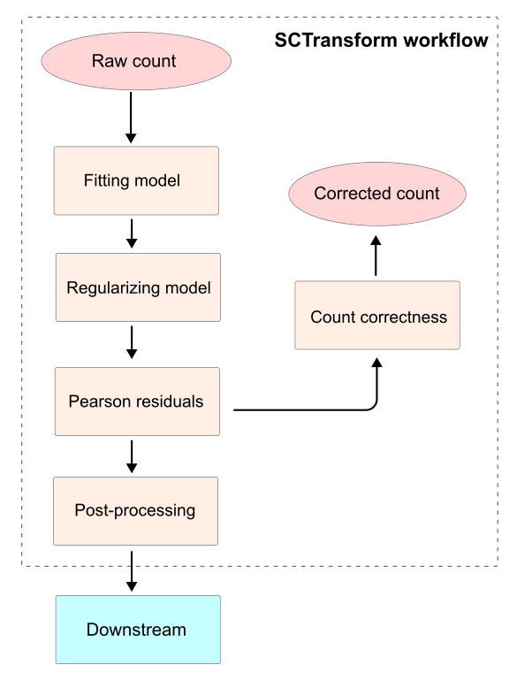

## Introduction

Normalization and preprocessing are the key challenges affecting directly to downstream scRNA-seq results, in which technically sequencing bias is cut down while biological variation is reserved. An effective workflow would eliminate technical bias among cells/samples and keep genewise heterogeneity without being overwhelmed by dominant genes [@hafemeisterNormalizationVarianceStabilization2019;@choudharyComparisonEvaluationStatistical2022]. 

Based on that, SCTransform is introduced as a probabilistic approach stabilizing variation in the count matrix [@hafemeisterNormalizationVarianceStabilization2019]. When there is a significant difference in cell expression originally, the SCTransform method is able to replace Seurat standard preprocessing workflow ([normalization](./normalization.md), [feature selection](./variable_features.md), and [scaling](./scaling.md)), mentioned in [pbmc3k_tutorial](https://satijalab.org/seurat/articles/pbmc3k_tutorial#normalizing-the-data).   

:::{tip} Seurat command

This command is captured from the [sctransform vignette](https://satijalab.org/seurat/articles/sctransform_vignette).

```R
pbmc <- SCTransform(pbmc, vars.to.regress = "percent.mt", verbose = FALSE)
```
Command explanation:

- `pbmc`: the Seurat object containing the count matrix.
- `vars.to.regress`: metadata columns is regressed out.
- `verbose`: print process messages.

:::

## Workflow



Overall, the raw count matrix is utilized for [Negative Binomial (NB) model estimate](#fitting-model) to determine the expected mean and overdispersion parameters for each gene. After the estimating, the raw likelihood parameters are highly variable across genes, a [regulation step](#regularizing-model) is applied to stabilize variance and reduce the sampling noise.

Next, the contribution of each element in the count matrix to the Chi-square dependence between genes and samples is quantified via [Pearson residuals](#pearson-residuals). Subsequently, [the count matrix is corrected](#count-correction) by eliminating technical noise across samples, and reconstructing normalized expression counts from the stabilized residuals.

Finally, the Pearson residuals undergo [post-processing](#post-processing), where highly variable features are identified, and confounding biological or technical covariates (such as cell viability indicated by the percentage of mitochondrial reads) can be regressed out, yielding a polished residual matrix ready for downstream analysis (e.g., PCA and clustering).

(fitting-model)=
### Fitting model

At the beginning, only genes obtaining an overdispersion factor ($\sigma^2 > \mu$) are used to train. A number of genes is randomly selected (default is 2,000) across their expression levels, and the total count of selected genes must be greater than 5 by default. Subsequently, their raw count matrix are modeled by Gamma-Poisson general linear model (Gamma-Poisson GLM), i.e Negative Binomial (NB) model, to properly obtain overdispersion. See [](./glmGamPoi.md) for more detail about the model-fitting process. 

Briefly, it uses the Maximum Likelihood Estimates (MLE) method to estimate coefficients of the model according to the count values of each gene. The coefficients include relative log-scaled count mean $\beta$, and overdispersion $\theta$. Note that the definition of overdispersion between sctransform and Gamma-Poisson GLM are reciprocal.

```{math}
:label: mean-var
\begin{cases}
\begin{aligned}

\sigma^2 &= \mu + \frac{1}{\hat{\theta}}\mu^2 \\
\alpha &= \hat{\theta} / \theta


\end{aligned}
\end{cases}
```

Next, theoretical overdispersion $\hat{\theta}$, which is derived from mean-variance relationship of NB model, shown as Equation [](#mean-var). $\alpha$ is the ratio of expected overdispersion ($\hat{\theta}$) over observed overdispersion ($\theta$), which originates from estimation above. If $\alpha < 0.001$, the model for that gene is assumed to follow the Poisson distribution ($\sigma^2 = \mu$, and $\theta = \infty$). 

(regularizing-model)=
### Regularizing model

#### Geometric mean

```{math}
:label: geometric-mean-fn

\mu_{\text{g}} = \exp\left[ \frac{1}{N} \sum_{j=1}^{N}{\ln(C_j + \epsilon)} \right] - \epsilon

```

For each gene, logarithmic geometric mean ($\mu_{\text{g}}$) computed by Equation [](#geometric-mean-fn), represents as a centric count without affected by outlier samples. With $C_j$ is the count value of sample $j$ in total $N$ samples, and $\epsilon$ (default is 1) is a small fixed number to avoid $\ln(0)$ [@hafemeisterNormalizationVarianceStabilization2019].

#### Local outlier detection

Local outlier genes along the $\mu_{g}$-axis are detected based on the matrices of the log-scaled overdispersion factor ($F = 1+\mu_g/\theta$) and $\beta$ estimated from Gamma-Poisson GLM. These parameters serve for variance and mean outlier indicators, respectively.

Initially, the genes are assigned to bins according to their $\mu_{g}$ value. The binwidth is determined using a heuristic rescale from the optimal bandwidth featured by @sheatherReliableDataBasedBandwidth1991 to ensure data is fairly distributed across bins (https://github.com/satijalab/sctransform/issues/214).

```{math}
:label: outlier-score

S = \frac{Y - \text{median}(Y)}{\text{MAD}(Y) + \epsilon}

```

For each evaluated matrix ($Y$ representing either $F$ or $\beta$), the outlier scores ($S$) are computed for the points within each bin following Equation [](#outlier-score), which measures the distance to the median and eliminates deviation by [Median Absolute Deviation (MAD)](https://en.wikipedia.org/wiki/Median_absolute_deviation) to enable comparability. For enhancing reliability, the measurement is processed on two overlapping grids, offset by half a binwidth. A gene is flagged as an outlier within a specific matrix when its absolute score on both grids exceeds a threshold, which defaults to 10.

Ultimately, a gene is marked as an outlier if it is flagged by either of the evaluated matrices (variance or mean).

(kernel-smoothing)=
#### Kernel smoothing

The estimated parameters ($F$ and $\beta$) are sequentially smoothed across gene expression levels (log geometric mean) using the Nadaraya-Watson kernel regression estimator [@nadarayaEstimatingRegression1964]. To avoid overfitting, this smoothing is anchored by the subset comprising overdispersion genes which exclude the previously flagged outliers and Poisson-like genes.

```{math}
:label: smoothing-func
\begin{cases}
\begin{aligned}

\large w_{ij} &= K\left(\frac{|\mu_{g}(i) - \mu_{g}(j)|}{\overline{\sigma}}\right) \\
\large \overline{y}_j &= \frac{\sum_{i=i_{\text{min}}}^m y_i \cdot w_{ij} }{\sum_{i=i_{\text{min}}}^m w_{ij}} 

\end{aligned}
\end{cases}
```

The smoothed value $\overline{y}_j$ of any gene $j$ is computed by weighted average of anchored genes, as defined in Equation [](#smoothing-func). Particularly, the weight ($w_{ij}$) is the density determined by the Gaussian kernel function $K$ at the distance between the current gene $j$ and anchored gene $i$ in the $\mu_g$ level. In $m$ overdispersion genes, the employed subset starts from anchored gene $i_{\text{min}}$, which is nearest to the boundary, four times the bandwidth h, from the targeted $\mu_g$ range. 


The interquartile of the distance distribution is assumed to be the range $[-0.25h, +0.25h]$, where $h$ is the optimal bandwidth of overdispersion genes by the method of @sheatherReliableDataBasedBandwidth1991, see [](./bandwidth_est.md) for details. Noticeably, the optimized $h$ is tripled by default. All together, this ensures that anchor genes lying closer to the expected range obtained higher weight.

```{math}
:label: sigma-kernel
\overline{\sigma} = \frac{0.25}{\Phi^{-1}(0.75)}h \approx 0.3707 \cdot h
```

Based on the assumption, standard deviation of the distance distribution ($\overline{\sigma}$) used in Equation [](#smoothing-func) computed by Equation [](#sigma-kernel) with $\Phi^{-1}(0.75)$ being the inverse cumulative distribution function of 75th percentile.

By the end, smoothed $\beta$ and $\theta$, which is recoverd from smoothed $F$, are utilized for the next process.   

(pearson-residuals)=
### Pearson residuals

While Chi-square test evaluates the global association between two categorical variables in a contingency table, Pearson residuals isolate the explicit contribution of each individual component (here, each gene-cell pair) to that overall dependence. The computation of specific Pearson residual ($z_{ij}$) for gene $i$ in cell $j$ is outlined in Equation [](#pearson-residuals-eq).

```{math}
:label: pearson-residuals-eq
\begin{cases}
\begin{aligned}

\mathbb{E}[c_{ij}] &= \exp(\beta_{i} + \ln(C_{j})) \\
\sigma_{ij}^2 &= \mathbb{E}[c_{ij}] + \frac{1}{\theta_{i}}\mathbb{E}[c_{ij}]^2 \\
z_{ij} &= \frac{c_{ij}  - \mathbb{E}[c_{ij}]}{\sigma_{ij}} 

\end{aligned}
\end{cases}
```

First, the expected count ($\mathbb{E}[c_{ij}]$) is calculated analogously to [the expected frequency in Chi-square test](https://www.rpubs.com/StatsResource/Chi_Square_Expected_Values) with the gene-specific log-scaled mean $\beta_i$ estimated in [the smoothing step](#kernel-smoothing) and the total count $C_{j}$ for each cell.

Hence count data assumably follows NB distribution, the variance ($\sigma_{ij}^2$) for residuals is derived from $\mathbb{E}[c_{ij}]$ as the mean, and smoothed overdispersion $\theta_i$.


Finally, the specific Pearson residual is measured from the deviation between the observe ($c_{ij}$, the actual count) and the expected value ($\mathbb{E}[c_{ij}]$), and scaled by standard deviation $\sigma_{ij}$ to ensure comparability. 

```{math}
:label: min-sigma
\sigma_{\text{min}}^2 = \left(  \frac{\text{median}(c_{ij})}{5}  \right)^2
```

In practice, the variance $\sigma_{ij}^2$ is bound by a lower threshold $\sigma_{\text{min}}^2$ defined in Equation [](#min-sigma), where the deviation is expected to be always greater than the general median, and the maximum of residual is 5.

(count-correction)=
### Count correction

Using the stabilized Pearson residuals, the raw count matrix is corrected following Equation [](#count-correction-fn).

```{math}
:label: count-correction-fn
\begin{cases}
\begin{aligned}

\mu_c(i) &= \exp\left( \beta_i + \text{median}(\ln(C_j)) \right) \\
\sigma_{c}^2(i) &= \mu_c(i) + \frac{1}{\theta_i} \mu_c(i)^2 \\
\mathbb{C}[c_{ij}] &= \mu_c(i) + z_{ij} \sigma_{c}(i)

\end{aligned}
\end{cases}
```

The gene-specific baseline mean $\mu_c(i)$ and variance $\sigma_{c}^2(i)$ used for this correction step are calculated similarly to $\mathbb{E}[c_{ij}]$ and $\sigma_{ij}^2$ in Equation [](#pearson-residuals-eq), excepting that specifying the median of log-scaled total count of samples.

Ultimately, the corrected count value ($\mathbb{C}[c_{ij}]$) is computed by the combination of the baseline mean count across samples, and the specific expectation deviation derived from the specific residual. Finally, the corrected values are polished by rounding, and the minimum floor set at 0.

(post-processing)=
### Post-processing

#### Feature selection

The top variable features (genes) are determined by ranking the variance of Pearson residuals across cells. 

In detail, after computing the raw residuals, they are practically clipped by the range $[-\sqrt{M/30}, \sqrt{M/30}]$ (where $M$ is the total number of cells) to mitigate the distorting impact of extreme outliers. Next, genewise variance of these clipped residuals is calculated and the genes are sorted to select the top variable features (capped at 3,000 features by default).  

#### Residualization

Subsequently, based on the parameter `vars.to.regress`, Pearson residuals are residualized against the percentage of mitochondrial genes, which reflects cell survival status. This step eliminates additional unwanted variance arising from technical errors or cell damage.

```{math}
:label: data-reg
\begin{cases}
\begin{aligned}

\mathbf{z}_i  &= A\mathbf{x} + \mathbf{r}_i \\
A &= \begin{bmatrix} {\scriptstyle \vert} & {\scriptstyle \vert} \\ 1 & p_{mt} \\ {\scriptstyle \vert} & {\scriptstyle \vert} \end{bmatrix}

\end{aligned}
\end{cases}
```


This dependency is modeled linearly, as shown in Equation [](#data-reg), where the Pearson residual vector of gene $i$ ($\mathbf{z}_i$) depends on a linear model of the mitochondrial gene percentage ($p_{mt}$) and an independent residual vector ($\mathbf{r}_i$).

:::{tip} Mathematical method to estimate new residual

To estimate the updated residual vector $\mathbf{r}_i$, the design matrix $A$ is factored via $QR$ decomposition using Householder transformations, which is both memory- and computationally efficient (see [Martijn's lecture](https://youtu.be/pOiOH3yESPM) for the detailed mathematical concepts).

```{math}
:label: res-math
\begin{aligned} 
\mathbf{r_i} &= \mathbf{z_i} - A\mathbf{x} \\ 
           &= Q \left( Q^T \mathbf{z_i} - R \mathbf{x} \right) \\ 
           &= Q \left[ \begin{pmatrix} \mathbf{c} \\ \mathbf{d} \end{pmatrix} - \begin{pmatrix} R \mathbf{x} \\ \mathbf{0} \end{pmatrix} \right] \\
           &= Q \begin{pmatrix} \mathbf{0} \\ \mathbf{d} \end{pmatrix}
\end{aligned}
```

The derivation is shown in Equation [](#res-math), where $\mathbf{c}$ and $\mathbf{d}$ are component vectors obtained by applying the Householder transformations to $\mathbf{z}_i$. Noticeably, $R\mathbf{x}$ is the projection of $\mathbf{z}_i$ onto the column space of $R$ ($R\mathbf{x} = \mathbf{c}$, where the length of vector $\mathbf{c}$ equals the number of columns in $A$).

:::

Finally, the resulting residuals are mean-centered within each gene.

## Summary

To reduce technical noise without losing statistical variance, sctransform fits and regularizes a negative binomial model to stabilize variance across genes. Technical bias across cells is removed via Pearson residualization while preserving true biological variation. Furthermore, top variable features are selected, and dependence on confounding covariates is regressed out.

Notably, the corrected count matrix is reconstructed directly from the initial Pearson residuals before post-processing. Consequently, the corrected counts remain independent of additional covariate regressions, thereby preserving the baseline biological variance of the raw counts.