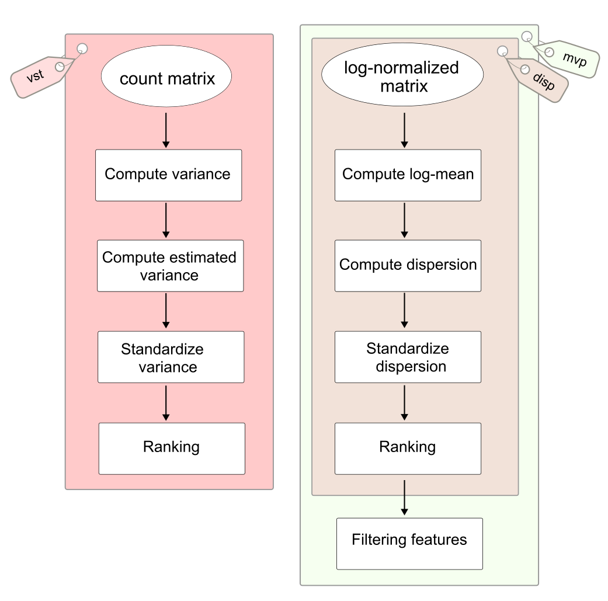

---
numbering:
    math: true
---

# Feature selection

## Introduction

## Methods



There are three available methods based on two distinct strategies for selecting highly variable features:

- [](#variance-stablilizing), which operates directly on the count matrix to estimate and standardize variance for feature ranking.
- [](#mean-var-plot) / [](#dispersion), which utilize the [log-normalized matrix](#log-normalize) to compute and standardize dispersion values. These dispersion values are subsequently used for gene ranking, while the mvp method additionally incorporates log-mean values to filter qualified features.  

(variance-stablilizing)=
### Variance stabilizing transformation (`vst`)

This method computes standardized variance based on the raw layer input (the `count` matrix).

```{math}
:label: compute-var
\Large \sigma_{i}^2 = \frac{\sum_{j=1}^{N}{(c_{ij} - \mu_{i})^2}}{N-1}
```

Firstly, the variance ($\sigma_{i}^2$) corresponding to each gene is computed following the formula [](#compute-var), where $c_{ij}$ is an element of gene $i$ and cell $j$ in the count matrix; $\mu_{i}$ is the mean of expression count of gene $i$; and N is the number of cells.

```{math}
:label: loess
\large \hat{\sigma_{i}}^2 = \text{LOESS} \left( \log_{10}(\sigma_i^2) \sim \log_{10}(\mu_i) \right)
```

Subsequently, the expected variance ($\hat{\sigma_{i}}^2$) is estimated by the Local Polynomial Regression model (LOESS) [@cleveland2017local]. The model fits a smooth trend to capture the relationship between gene abundance and variance in log-log space (the formula [](#loess)). Using local parabolic fitting, the expected variance is estimated across the mean expression range to generate a continuous, smooth curve (See [brilliant Josh's explanation](https://www.youtube.com/watch?v=Vf7oJ6z2LCc)).

```{math}
:label: compute-std-var
\Large
\begin{cases}
\begin{aligned}
z_{ij} &= \frac{c_{ij} - \mu_{i}}{\hat{\sigma_{i}}} \\
\bar{\sigma_{i}}^2 &= \frac{\sum_{j=1}^{N}{\left[\min(\sigma_{\text{max}}, z_{ij})\right]^2}}{N-1}
\end{aligned}
\end{cases}
```

Finally, the standardized variance ($\bar{\sigma_{i}}^2$) for gene $i$ is computed by formula [](#compute-std-var), which represents the variance of the standardized values ($z_{ij}$) across all cells, capped at a maximum value of $\sigma_{\text{max}} = \sqrt{N}$, which ensures the balanced distribution of variance, preventing outliers from overwhelmingly escalating the gene's overall variance.

The genes are then ranked by their standardized variance in descending order to select the top highly variable features (default `nfeatures = 2000`).

:::{tip}Why not utilize raw variance directly for sorting out features?

Due to the fact that variance rapidly increases as expression values rise [@ahlmann-eltzeComparisonTransformationsSinglecell2023], even when utilizing variance calculated from log-normalized data, highly expressed genes will dominate the top rankings [@stuartComprehensiveIntegrationSingleCell2019]. By standardizing the variance instead, this effect is controlled while retaining relative, feature-specific variability.

:::

(mean-var-plot)=

### Mean variance plot (`mvp`)

The [log-normalized matrix](./normalization.md#log-normalize) is utilized to execute this approach. The workflow begins by computing log-mean ($\text{log}_{\mu_{i}}$) via equation [](#mean-mvp) to divide the features into discrete computational bins. Next, the dispersion value for each gene ($disp_i$) is calculated using the system of equations defined in [](#disp-comp). Finally, equation [](#disp-std) standardizes dispersion based on the mean and standard deviation of its assigned bin. These standardized dispersion values are ultimately used alongside the log-mean values to sort and select the most highly variable features.

```{math}
:label: mean-mvp
\Large \text{log}_{\mu_{i}} = \ln \left( 1 + \frac{1}{N} \sum^{N}_{j=1}{\left(e^{LN_{ij}} - 1\right)} \right)
```

The formula [](#mean-mvp) reverses the [log-normalization](#log-norm) step to recover relative count ($RC_{ij}$), calculates the arithmetic mean of these relative counts for each gene, and finally converts the resulting mean back to the log scale using the $\ln(1+x)$ transformation.

The values of log-mean are utilized to divide the genes into distinct bins, where the total number of bins is controlled by the `num.bin` attribute (which defaults to 20).

```{math}
:label: disp-comp
\Large
\begin{cases}
\begin{aligned}
  \mu_i   &= \frac{1}{N} \sum_{j=1}^{N} RC_{ij} \\
  \sigma_i^2  &= \frac{1}{N - 1} \sum_{j=1}^{N} \left( RC_{ij} - \mu_i \right)^2 \\
  disp_i &= \ln \left( \frac{\sigma_i^2}{\mu_i} \right)
\end{aligned}
\end{cases}
```

Hence, the relationship between the mean and variance of background genes is expected to follow a Poisson distribution, where $\mu_i = \sigma_i^2$. Consequently, the variance-to-mean ratio (VMR), or Fano factor, for these background features should equal 1. A larger VMR indicates that a gene exhibits greater overdispersion, thereby capturing meaningful biological variability across cells [@obergTechnicalBiologicalVariance2012;@willsSinglecellGeneExpression2013]. The system of equations in [](#disp-comp) models this by calculating dispersion ($disp_i$), defined as the natural logarithm of the VMR of the relative counts.


```{math}
:label: disp-std
\Large
\overline{disp}_i = \frac{disp_i - \mu_{\text{bin}_k}}{\sigma_{\text{bin}_k}}
```

Next, the formula [](#disp-std) standardizes the dispersion values using the mean and standard deviation of the specific computational bin ($\text{bin}_k$) assigned to each gene based on its log-mean expression. Finally, the genes are sorted in descending order according to these scaled values, and the top features are selected (determined by the `nfeatures` attribute).

Additionally, these features are filtered based on default threshold ranges: the log-mean expression must fall between 0.1 and 8 (`mean.cutoff`), and the standardized dispersion must be greater than 1 (`dispersion.cutoff`).   

:::{tip} Why should we divide features into bins?

Because variance naturally increases with mean expression, highly expressed genes tend to dominate the dispersion rankings. Dividing features into localized bins ensures that variability of each gene is evaluated exclusively against peers with a similar expression level.

:::

(dispersion)=
### Dispersion (`disp`)

The dispersion mode follows the same procedure as [](#mean-var-plot), except that features are not filtered according to log-mean and standardized dispersion at the end of the workflow. 


## Summary

| Method                                        |  Purpose         |  A-code    |
| :--------------------------------------------  | :---------------- | :--------- |
| Variance stabilizing transformation (*default*) |                  | [FindVariableFeatures_vst.R](https://raw.githubusercontent.com/Truongphi20/seurat_blog/refs/heads/main/algorithm_code/FindVariableFeatures_vst.R)  |
| Mean variance plot                            |                    | [FindVariableFeatures_mvp.R](https://raw.githubusercontent.com/Truongphi20/seurat_blog/refs/heads/main/algorithm_code/FindVariableFeatures_mvp.R) |
| Dispersion                                    |                    | [FindVariableFeatures_disp.R](https://raw.githubusercontent.com/Truongphi20/seurat_blog/refs/heads/main/algorithm_code/FindVariableFeatures_disp.R) |